<div align="center">
  

  <h1>Freecat Blog</h1>

  <p>Write locally, back up with GitHub, and deploy a personal blog for free</p>

  <p><a href="README.md">简体中文</a> | English</p>

  <p>
    
    
    
    
  </p>

  <p>
    <a href="https://freecat-blog.pages.dev">Live Demo 01</a> |
    <a href="https://freecat-blog-op.pages.dev">Live Demo 02</a>
  </p>
</div>

> **Tip:** If you run into build issues, simply go to the main repository, copy the latest [sync-upstream](https://github.com/OUBIGFA/Freecat-Blog/blob/main/.github/workflows/sync-upstream.yml) or [update-git-dates.yml ](https://github.com/OUBIGFA/FreeBlog_BIGFA/blob/main/.github/workflows/update-git-dates.yml)workflow file to your repo, and run it manually. It only syncs build files and will not overwrite your custom settings or writing/ folder.

## Shortest Deployment Path

1. Create your own private blog repository with GitHub Importer
2. Import the repository into Cloudflare Pages or Vercel and build
3. Wait for the build to finish, then open the default URL to verify

---

## Shortest Usage Path

1. Clone the repository to your computer with GitHub Desktop
2. Open the project locally and write or drop an article into the `writing` folder
3. Commit and push to GitHub via GitHub Desktop
4. Wait for the platform to build and deploy automatically
5. Done

---

## Just Three Things

- Your content stays local. It is not locked into any platform.
- GitHub handles backup and notifies the deployment platform.
- The deployment platform only generates the website. It is not your writing backend.

## Table of Contents

- [1. What Is Freecat Blog](#1-what-is-freecat-blog)
- [2. The Three Folders You Need to Know](#2-the-three-folders-you-need-to-know)
- [3. Preparation](#3-preparation)
- [4. Quick Deployment](#4-quick-deployment)
- [5. Write Articles and Customize the Site](#5-write-articles-and-customize-the-site)
- [6. Daily Update Workflow](#6-daily-update-workflow)
- [7. Advanced Features](#7-advanced-features)
- [8. Template Update Sync](#8-template-update-sync)
- [9. FAQ](#9-faq)
- [License](#license)

---

## 1. What Is Freecat Blog

Freecat Blog is a personal blog template that turns local Markdown articles into a website automatically.

How it works:

```text
Your computer: write in writing/ and edit site settings in Control/
        ↓
GitHub Desktop syncs changes to GitHub
        ↓
Cloudflare Pages / Vercel builds automatically
        ↓
Your blog website updates automatically
```

Your articles and settings are stored on both your computer and GitHub. Cloudflare Pages / Vercel only generates and publishes the web pages, so your content does not disappear if you switch platforms later.

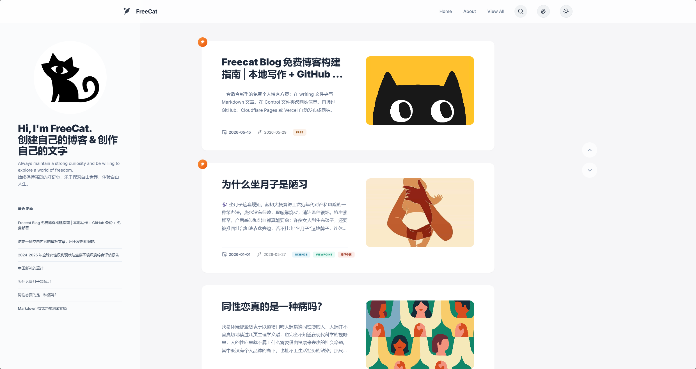
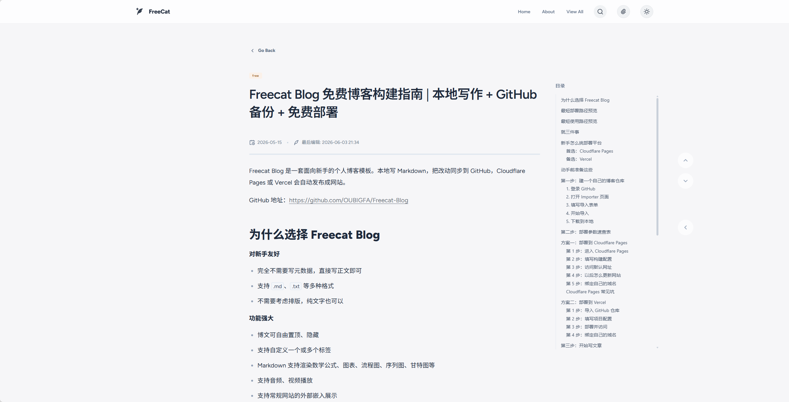
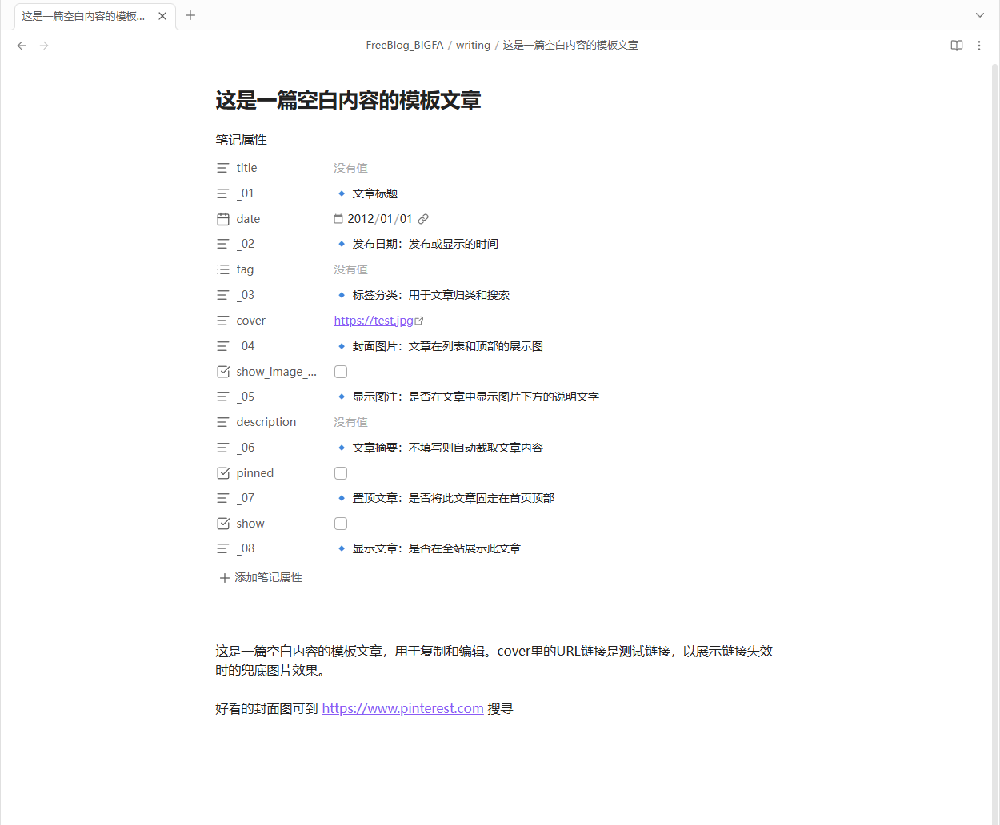

Good for people who:

- Want a personal blog without buying a server or maintaining a backend
- Want to write with Markdown, Obsidian, VS Code, or another editor
- Want to keep article files under their own control
- Want free deployment and the option to switch platforms later

What you get:

- Auto-generated home page, article pages, archive, search, and About page
- Article fields for tags, cover image, summary, pinning, and visibility
- Automatic formatting for mixed Chinese/English text, number-unit spacing, code blocks, and math
- Built-in SEO and AI discovery support, including Sitemap, RSS, llms.txt, and a simple Google/Bing submission guide. See `Control/SEO_搜索优化.md` for details
- Audio player generation from direct audio links in articles
- Site name, avatar, social links, and theme customization without writing code

---

## 2. The Three Folders You Need to Know

| Folder | Edit often? | Purpose |
| --- | --- | --- |
| `writing/` | Yes | Blog articles. One Markdown file is one article |
| `Control/` | Yes | Site name, avatar, home intro, social links, About page |
| `all/` | No | Deployment platforms build the website from here |

Remember this:

**Write articles in** `writing/`, edit site information in `Control/`, and set the deployment root directory to `all`.

---

## 3. Preparation

| Tool / Account | Required? | Purpose | Link |
| --- | --- | --- | --- |
| GitHub account | Required | Stores your blog repository | <https://github.com/signup> |
| GitHub Desktop | Required | Syncs local changes to GitHub | <https://desktop.github.com/download> |
| Markdown editor | Required | Writes articles and edits settings; Obsidian is recommended | <https://obsidian.md/> |
| Cloudflare account | Recommended | Free blog deployment | <https://dash.cloudflare.com/sign-up> |
| Vercel account | Optional | Another free deployment option | <https://vercel.com/signup> |

Choose either Cloudflare Pages or Vercel. Complete beginners should start with Cloudflare Pages.

---

## 4. Quick Deployment

Deployment has two steps:

1. Copy Freecat Blog into your own GitHub repository.
2. Connect that repository to Cloudflare Pages or Vercel.

### Step 1: Create Your Own GitHub Repository

1. Sign in to GitHub.
2. Open <https://github.com/new/import>.
3. Fill in the form:

| Field | Value |
| --- | --- |
| `Your old repository's clone URL` | `https://github.com/OUBIGFA/Freecat-Blog` |
| `Owner` | Your GitHub account |
| `Repository name` | Choose a name, such as `my-freecat-blog` |
| `Privacy` | Use `Private` |

1. Click `Begin import` and wait for it to finish.
2. Open GitHub Desktop and click `File` -> `Clone repository`.
3. Select the imported repository and clone it to your computer.

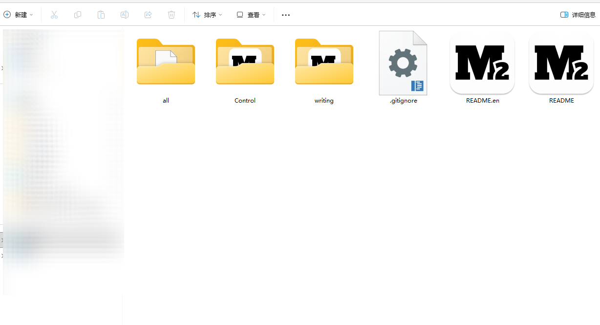

After importing, your computer has a complete Freecat Blog project folder.

### Step 2: Deploy to Cloudflare Pages

Cloudflare Pages is the recommended option. The key is filling in the build settings correctly.

1. Sign in to the [Cloudflare Dashboard](https://dash.cloudflare.com/).
2. Create an application.

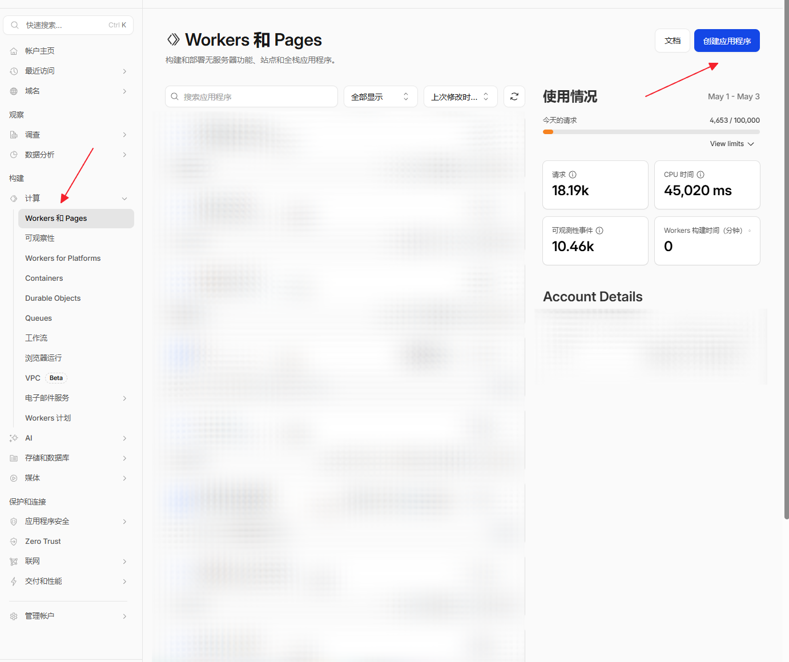

1. Select Pages.

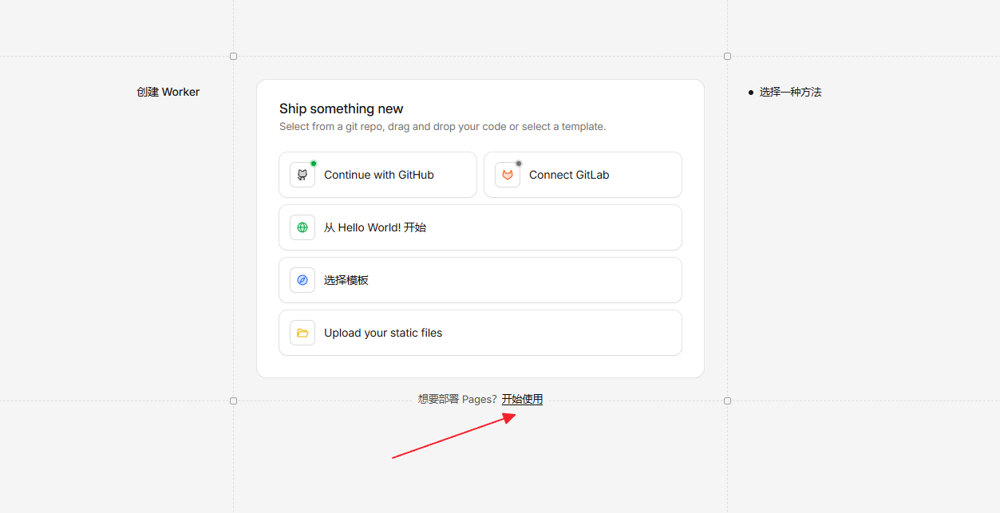

1. Choose "Import an existing Git repository".

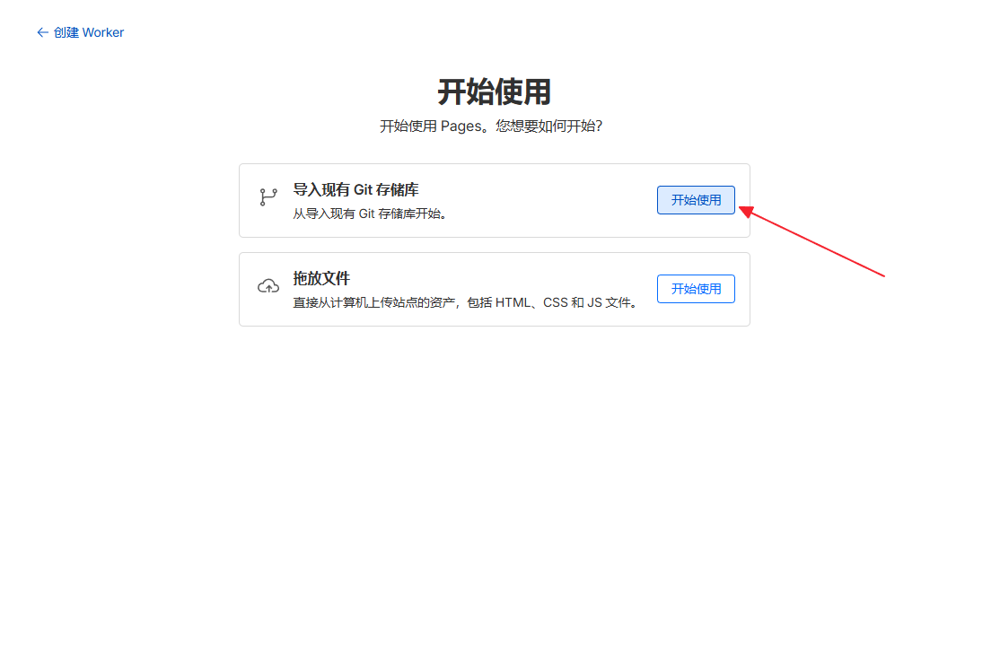

1. Select your blog repository.

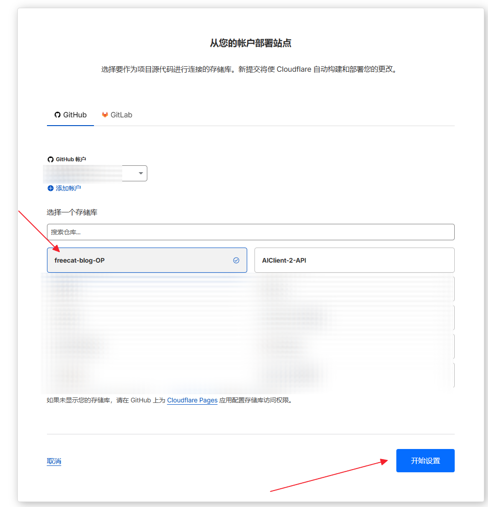

1. Fill in the build settings:

| Cloudflare English UI | Cloudflare Chinese UI | Value |
| --- | --- | --- |
| Framework preset | 框架预设 | `None` / leave unset |
| Root directory (advanced) > Path | 根目录（高级） | `all` |
| Build command | 构建命令 | `npm run build` |
| Build output directory | 构建输出目录 | `dist` |
| Environment variables | 环境变量 | `NODE_VERSION` = `20` |

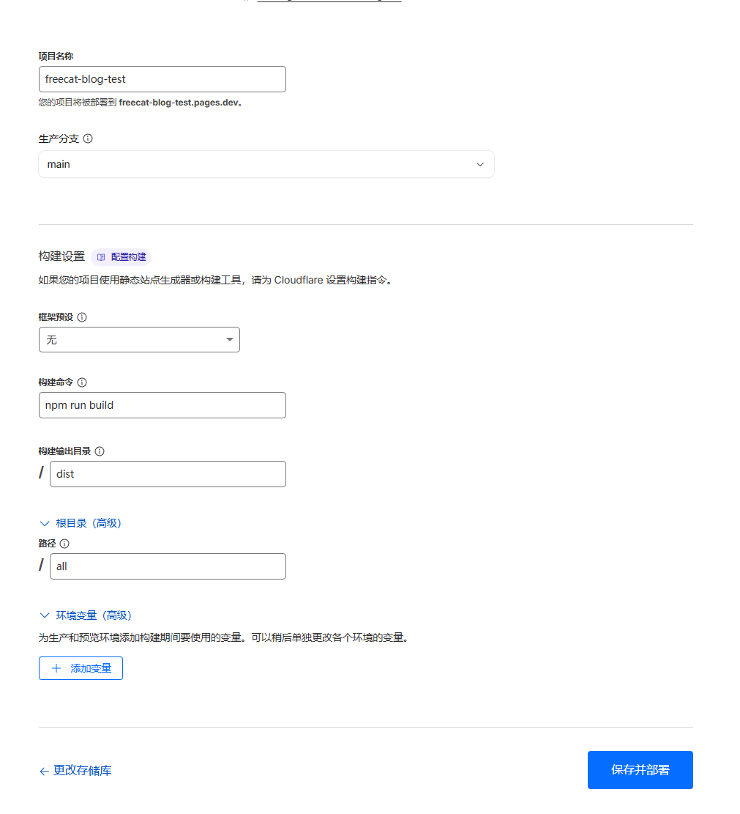

> The most common mistake: set output directory to `dist`, not `all/dist`, because the root directory is already `all`.

1. Click `Save and Deploy` and wait 1-3 minutes.
2. When the build finishes, open the default URL from Cloudflare, such as `xxx.pages.dev`.

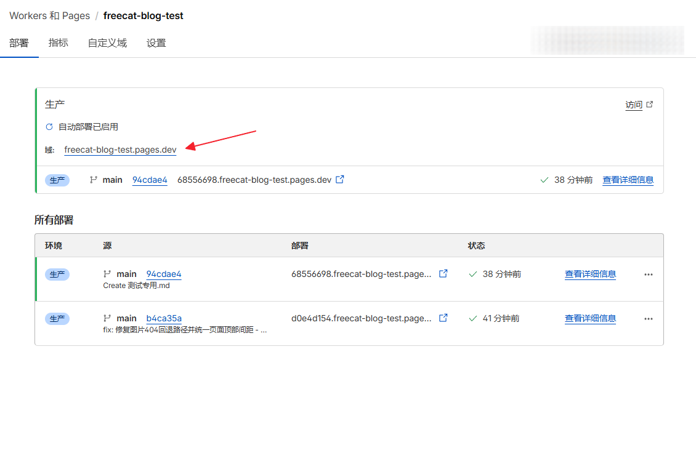

To use your own domain, bind a custom domain in the Cloudflare Pages project.

- Free domain guide: [免费域名申请指南](https://blog.freeorg.dpdns.org/posts/%E5%85%8D%E8%B4%B9%E5%9F%9F%E5%90%8D%E7%94%B3%E8%AF%B7%E6%8C%87%E5%8D%97.html)
- DNSHE auto-renew project: <https://github.com/OUBIGFA/dnshe-auto-renew>

### Alternative: Deploy to Vercel

If you already use Vercel, you can choose it directly.

1. Sign in to [Vercel](https://vercel.com/).
2. Click `Add New...` -> `Project`.
3. Connect GitHub and choose your blog repository.
4. Fill in the settings:

| Field | Value |
| --- | --- |
| Framework Preset | Keep default, or choose static/other |
| Root Directory | `all` |
| Build Command | `npm run build` |
| Output Directory | `dist` |
| Node Version | `20` |

1. Click `Deploy`.

To bind a custom domain, open project settings -> `Domains` and follow the DNS instructions.

---

## 5. Write Articles and Customize the Site

### Write Articles: Use `writing/`

`writing/` is the folder you will use most. Each `.md` file is one article.

The project includes sample articles. You can open them to learn the format, copy one as a template, or delete them.

A new article usually starts like this:

```md
---
title: My First Article
date: 2026-01-01
tag:
  - notes
cover:
show_image_captions: true
description:
pinned: false
show: true
---

Article content starts here.
```

Common fields:

| Field | Purpose | Example |
| --- | --- | --- |
| `title` | Article title; filename is used if empty | `My First Article` |
| `date` | Publish date | `2026-01-01` |
| `tag` | Article tags; multiple allowed | `- notes` |
| `cover` | Cover image URL; empty means no cover | `https://...` |
| `show_image_captions` | Show image captions | `true` / `false` |
| `description` | Article summary; empty means auto excerpt | `A short intro` |
| `pinned` | Pin to top | `true` / `false` |
| `show` | Show on the website | `true` / `false` |

### Embed an Audio Player

Use blockquote syntax with a direct audio link:

```md
>[Demo audio](https://example.com/audio.m4a)
```

If the link has no obvious audio extension, add the music symbol in the title:

```md
>[🎵Demo audio](https://example.com/audio)
```

Supported formats: `.mp3`, `.m4a`, `.wav`, `.ogg`, `.aac`, `.flac`, `.opus`.

### Customize the Site: Use `Control/`

`Control/` is the site control panel. Edit it to turn the template into your own blog.

| File | Purpose |
| --- | --- |
| `site_网站属性.md` | Site title, site name, home intro, avatar, theme |
| `SEO_搜索优化.md` | Canonical domain, SEO summary, author info, AI crawlers, llms.txt |
| `social_社交媒体.md` | Social icons, profile links, contact methods, promo links |
| `about_关于页面.md` | About page title, intro, and avatar |

Editing rules:

- Keep one space after the colon, such as `site_name: FreeCat`
- Leave unused fields empty, but do not delete the whole line
- Lines starting with `_01`, `_02`, etc. are descriptions; do not rename them
- Commit and push with GitHub Desktop after editing, otherwise the live site will not update

---

## 6. Daily Update Workflow

After deployment, every article or site update follows these 5 steps:

1. Add or edit articles in `writing/`.
2. Edit site settings in `Control/` if needed.
3. Save the files.
4. Open GitHub Desktop, write a short commit message, and click `Commit to main`.
5. Click `Push origin`.

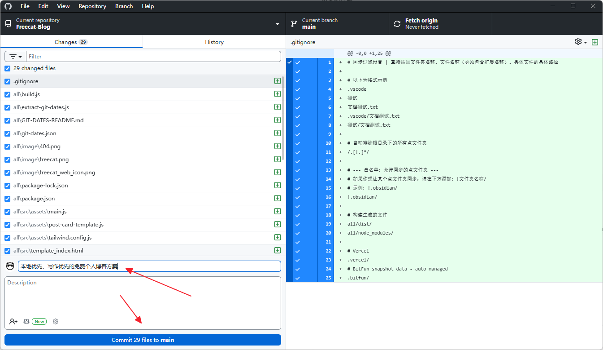

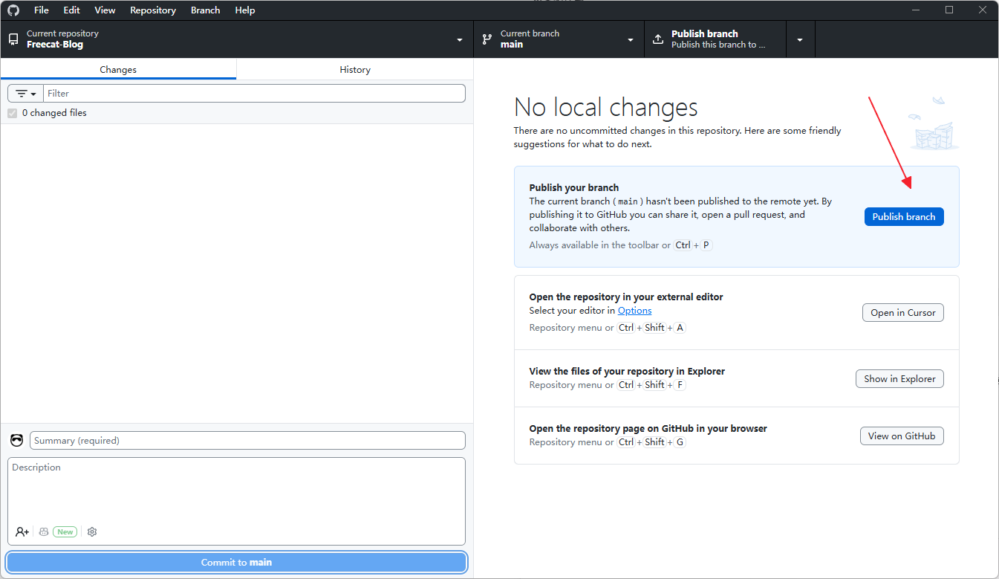

After syncing, Cloudflare Pages or Vercel rebuilds automatically. Refresh the site after 1-3 minutes to see the new content.

---

## 7. Advanced Features

### Writing with Obsidian

You can open this blog repository directly in Obsidian and write articles in `writing/`.

Benefits:

- Articles stay local and easy to manage
- You can use Obsidian backlinks, tags, and search
- After writing, sync with GitHub Desktop and the site publishes automatically

### Local Preview and Build

If you only write articles and deploy, you do not need to build locally. The deployment platform handles it.

To preview on your computer, install [Node.js 20+](https://nodejs.org/) first, then run:

```bash
cd all
npm install
npm run build
```

The output is in `all/dist/`. Do not edit it manually and do not commit it to GitHub.

### Project Structure

```text
Freecat-Blog/
├── Control/                # Site config, mainly edited by beginners
│   ├── site_网站属性.md
│   ├── SEO_搜索优化.md
│   ├── social_社交媒体.md
│   └── about_关于页面.md
├── writing/                # Article Markdown files
├── all/                    # Build project; deployment platforms build here
│   ├── src/                # Page templates
│   ├── image/              # Image assets
│   ├── build/              # Build helpers
│   ├── build.js            # Main build script
│   ├── package.json        # Build dependencies and scripts
│   └── dist/               # Build output, generated locally
├── README.md
└── README.en.md
```

---

## 8. Template Update Sync

Freecat Blog may continue to receive bug fixes, features, and style improvements. The repository includes this GitHub Actions workflow:

`.github/workflows/sync-upstream.yml`

Every Tuesday at 02:17 Beijing time, it syncs template files from [OUBIGFA/Freecat-Blog](https://github.com/OUBIGFA/Freecat-Blog) and commits them to your `main` branch. Cloudflare Pages / Vercel rebuilds automatically after that commit.

Important: whether you created your repository with GitHub Importer or by forking this project, GitHub may not run repository Actions by default. Before relying on automatic template sync, open the `Actions` tab in your own repository and enable workflows if GitHub asks. The repository Actions permission must also allow write access, otherwise the sync can fetch upstream changes but cannot commit them back to your `main` branch.

Sync scope:

- Synced: `all/`, `README.md`, `README.en.md`
- Preserved: `all/git-dates.json`
- Not touched: `Control/`, `writing/`, `.github/`, `.gitignore`

Your own articles and site settings will not be overwritten by template updates.

To run the sync immediately:

1. Open your GitHub repository.
2. Click `Actions`.
3. Select `Sync upstream template files`.
4. Click `Run workflow` -> `Run workflow`.

Notes:

- If upstream template files have not changed, the workflow skips the commit.
- If the `Actions` page says workflows are disabled, or this is the first time you open `Actions` after importing/forking, enable them first. After enabling, you can click `Run workflow` once to test it.
- If you edited templates, styles, or build scripts in `all/`, automatic sync may overwrite those edits. Beginners usually do not need to edit `all/`.

---

## 9. FAQ

**Q: Do I need to know how to code?**

No. Day to day, you only write Markdown articles and edit config files.

**Q: Where should I usually edit?**

Articles go in `writing/`. Site settings go in `Control/`. Beginners usually should not edit `all/`.

**Q: Do I have to buy a domain?**

No. Cloudflare Pages and Vercel both provide a default URL first.

**Q: Cloudflare Pages or Vercel, which should I choose?**

Complete beginners should choose Cloudflare Pages. If you already use Vercel, Vercel is fine. Your content is on GitHub, so you can migrate later.

**Q: What is the easiest setting to get wrong during deployment?**

`Root Directory` must be `all`, and `Output Directory` must be `dist`. Do not write `all/dist`.

**Q: I changed files locally, but the site did not update. What should I check?**

Check in order: files are saved -> GitHub Desktop has pushed -> Cloudflare Pages / Vercel started a new build -> browser may need a force refresh.

**Q: Can I delete the sample articles?**

Yes. Sample articles are in `writing/`. Delete them, then commit and push.

---

## License

This project is released under the MIT License.
