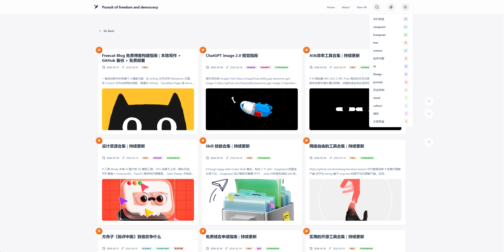

<div align="center">
  

  <h1>Freecat Blog</h1>

  <p>本地写作、GitHub 备份、免费部署的个人博客模板</p>

  <p>简体中文 | <a href="README.en.md">English</a></p>

  <p>
    
    
    
    
  </p>

  <p>
    <a href="https://freecat-blog.pages.dev">演示站点 01</a> |
    <a href="https://freecat-blog-op.pages.dev">演示站点 02</a>
  </p>
</div>

## 为什么选择 Freecat Blog

**数据在自己手上**

- 文章原稿保存在你的电脑和 GitHub 仓库里
- 即使云端部署或平台服务出错，也不会失去文字的所有权
- 不被单个平台锁住，随时可以备份、迁移或重新发布

**功能强大**

- 博文可自由置顶、隐藏
- 支持自定义一个或多个标签
- Markdown 支持渲染数学公式、图表、流程图、序列图、甘特图等
- 支持音频、视频播放
- 支持常规网站的外部嵌入展示
- 超长代码块自动折叠，内置回到顶部/底部和展开/折叠的跟随控制器

**对新手友好**

- 可选择完全不写元数据，直接写正文即可
- 通过 Markdown 元数据和控制文件里的简单填写或勾选，就能直观定制网站外观、资料、社交链接、置顶和显示状态，告别复杂后台和代码
- 支持 `.md`、`.txt` 等多种格式
- 不需要考虑排版，纯文字也可以

**排版自动优化**

- 自动优化中英混排间距
- 专注内容写作，系统自动处理格式

> **提示：** 如遇构建相关问题，只需前往主仓库复制最新的 [sync-upstream](https://github.com/OUBIGFA/Freecat-Blog/blob/main/.github/workflows/sync-upstream.yml) 或 [update-git-dates.yml](https://github.com/OUBIGFA/FreeBlog_BIGFA/blob/main/.github/workflows/update-git-dates.yml) 工作流文件到你的仓库并手动运行一次。该工作流仅同步构建文件，不会覆盖你的自定义设置和 writing/ 写作文件夹。如需使用新增功能，请从主仓库 [Control 文件夹](https://github.com/OUBIGFA/Freecat-Blog/tree/main/Control) 复制对应控制参数到你仓库的 `Control/` 文件夹。

## 最短部署路径预览

1. 用 [GitHub Importer](https://github.com/new/import) 导入并转换成私人博客仓库
2. 去 Cloudflare Pages 或 Vercel 导入仓库构建
3. 等部署完成，打开默认网址确认

***

## 最短使用路径预览

1. 用 [GitHub Desktop](https://desktop.github.com/download) 拉到本地
2. 本地打开项目，在`writing`文件夹中撰写或存入一篇文章
3. 通过GitHub Desktop提交并同步到 GitHub
4. 等待平台自动部署构建
5. 完成

***

## 就三件事

* 内容在本地，不锁死在任何平台。

* GitHub 负责备份，顺便通知部署平台更新。

* 部署平台只管生成网站，不是你的写作后台。

## 目录

* [一、Freecat Blog 是什么](#%E4%B8%80freecat-blog-%E6%98%AF%E4%BB%80%E4%B9%88)

* [二、你只需要记住三个文件夹](#%E4%BA%8C%E4%BD%A0%E5%8F%AA%E9%9C%80%E8%A6%81%E8%AE%B0%E4%BD%8F%E4%B8%89%E4%B8%AA%E6%96%87%E4%BB%B6%E5%A4%B9)

* [三、准备工作](#%E4%B8%89%E5%87%86%E5%A4%87%E5%B7%A5%E4%BD%9C)

* [四、快速部署](#%E5%9B%9B%E5%BF%AB%E9%80%9F%E9%83%A8%E7%BD%B2)

* [五、写文章和改网站](#%E4%BA%94%E5%86%99%E6%96%87%E7%AB%A0%E5%92%8C%E6%94%B9%E7%BD%91%E7%AB%99)

* [六、日常更新流程](#%E5%85%AD%E6%97%A5%E5%B8%B8%E6%9B%B4%E6%96%B0%E6%B5%81%E7%A8%8B)

* [七、进阶功能](#%E4%B8%83%E8%BF%9B%E9%98%B6%E5%8A%9F%E8%83%BD)

* [八、模板更新同步](#%E5%85%AB%E6%A8%A1%E6%9D%BF%E6%9B%B4%E6%96%B0%E5%90%8C%E6%AD%A5)

* [九、常见问题](#%E4%B9%9D%E5%B8%B8%E8%A7%81%E9%97%AE%E9%A2%98)

* [许可证](#%E8%AE%B8%E5%8F%AF%E8%AF%81)

***

## 一、Freecat Blog 是什么

Freecat Blog 是一个把本地 Markdown 文章自动发布成网站的个人博客模板。

工作方式是这样：

```text
本地电脑：在 writing/ 写文章，在 Control/ 改网站信息
        ↓
GitHub Desktop 同步到 GitHub
        ↓
Cloudflare Pages / Vercel 自动构建
        ↓
博客网站自动更新
```

文章和配置同时存在本地和 GitHub 上，Cloudflare Pages / Vercel 只负责生成网页并发布，所以以后换平台也不会丢内容。




适合这样几类人：

* 想拥有个人博客，但不想买服务器、不想维护后台

* 想用 Markdown、Obsidian、VS Code 等工具写文章

* 想把文章文件掌握在自己手里

* 想免费部署，未来还能切换平台

你会拿到这些功能：

* 自动生成首页、文章页、归档页、搜索页、About 页

* 文章支持标签、封面、摘要、置顶、显示/隐藏

* 自动优化中英混排、数字单位间距、代码块、数学公式

* 内置 SEO 和 AI 检索支持，可生成 Sitemap、RSS、llms.txt，并引导你提交到 Google 与 Bing。详情见 `Control/SEO_搜索优化.md`

* 文章里放音频直链就能自动生成播放器

* 不写代码就能改网站名、头像、社交链接和主题

***

## 二、你只需要记住三个文件夹

| 文件夹        | 是否经常改 | 作用                          |
| ---------- | ----- | --------------------------- |
| `writing/` | 要     | 放博客文章。一篇 Markdown 文件就是一篇文章  |
| `Control/` | 要     | 改网站名称、头像、首页介绍、社交链接、About 页面 |
| `all/`     | 不需要   | 部署平台从这里构建网站                 |

记住这一句就够。

**写文章去** `writing/`，改网站信息去 `Control/`，部署时根目录填 `all`。

***

## 三、准备工作

| 工具 / 账号        | 是否必需 | 用途                  | 地址                                    |
| -------------- | ---- | ------------------- | ------------------------------------- |
| GitHub 账号      | 必需   | 保存博客仓库              | <https://github.com/signup>           |
| GitHub Desktop | 必需   | 把本地改动同步到 GitHub     | <https://desktop.github.com/download> |
| Markdown 编辑器   | 必需   | 写文章和改配置，推荐 Obsidian | <https://obsidian.md/zh>              |
| Cloudflare 账号  | 推荐   | 免费部署博客网站            | <https://dash.cloudflare.com/sign-up> |
| Vercel 账号      | 可选   | 另一种免费部署方式           | <https://vercel.com/signup>           |

Cloudflare Pages 和 Vercel 二选一就行。完全新手先用 Cloudflare Pages。

***

## 四、快速部署

整个部署分两步。

1. 把 Freecat Blog 复制成你自己的 GitHub 仓库。
2. 把这个仓库连接到 Cloudflare Pages 或 Vercel。

### 步骤 1：创建自己的 GitHub 仓库

1. 登录 GitHub。
2. 打开 <https://github.com/new/import>。
3. 按下表填写各项。

| 字段                                | 填写值                                       |
| --------------------------------- | ----------------------------------------- |
| `Your old repository's clone URL` | `https://github.com/OUBIGFA/Freecat-Blog` |
| `Owner`                           | 你的 GitHub 账号                              |
| `Repository name`                 | 自己起一个仓库名，例如 `my-freecat-blog`             |
| `Privacy`                         | 选 `Private`                               |

1. 点 `Begin import`，等导入完成。
2. 打开 GitHub Desktop，点 `File` → `Clone repository`。
3. 选刚导入的仓库，下载到本地。


导入完成后，电脑上就有一个完整的 Freecat Blog 项目文件夹。

### 步骤 2：部署到 Cloudflare Pages

Cloudflare Pages 是推荐方案，构建参数要填对。

1. 登录 [Cloudflare Dashboard](https://dash.cloudflare.com/)。
2. 创建应用程序。


1. 选 Pages。


1. 选「导入现有 Git 仓库」。


1. 选你自己的博客仓库。


1. 按下表填写构建参数。

| Cloudflare 中文界面 | Cloudflare English UI            | 填写值                   |
| --------------- | -------------------------------- | --------------------- |
| 框架预设            | Framework preset                 | `None` / `无` / 不选预设   |
| 根目录（高级）         | Root directory (advanced) > Path | `all`                 |
| 构建命令            | Build command                    | `npm run build`       |
| 构建输出目录          | Build output directory           | `dist`                |
| 环境变量（建议填写）      | Environment variables            | `NODE_VERSION` = `20` |


> 最常踩的坑是输出目录写成 `all/dist`。正确写 `dist`，因为根目录已经切到 `all` 了。

1. 点 `Save and Deploy`，等 1-3 分钟。

> 建议在 Cloudflare Pages 项目设置里启用 `Build cache（构建缓存）`。字体子集工具链完全走 npm 依赖，依赖缓存命中后安装只需几秒；仓库自带的字体子集能覆盖当前文章字符时会直接复用，文章新增字符后也只需几秒到几十秒就能在构建中重新生成字体集，无需 Python 环境。

2. 构建完成后，打开 Cloudflare 给的默认网址，例如 `xxx.pages.dev`。


想用自己的域名，在 Cloudflare Pages 项目里绑定自定义域名就行。

* 免费域名教程：[免费域名申请指南](https://blog.freeorg.dpdns.org/posts/%E5%85%8D%E8%B4%B9%E5%9F%9F%E5%90%8D%E7%94%B3%E8%AF%B7%E6%8C%87%E5%8D%97.html)

* DNSHE 自动续期项目：<https://github.com/OUBIGFA/dnshe-auto-renew>

### 备选：部署到 Vercel

已经在用 Vercel 的，可以直接选它。

1. 登录 [Vercel](https://vercel.com/)。
2. 点 `Add New...` → `Project`。
3. 连接 GitHub，选你的博客仓库。
4. 按下表填写。

| 字段               | 填写值             |
| ---------------- | --------------- |
| Framework Preset | 保持默认，或选择静态/其他类型 |
| Root Directory   | `all`           |
| Build Command    | `npm run build` |
| Output Directory | `dist`          |
| Node Version     | `20`            |

Vercel 会自动恢复构建缓存。Freecat Blog 会复用其中的字体子集缓存；如果文章没有新增字符，后续部署会跳过字体生成。不要在项目设置里主动清空 Build Cache，除非你确实想强制重新生成。

1. 点 `Deploy`。

绑定自定义域名时，进项目设置里的 `Domains`，按提示改解析即可。

***

## 五、写文章和改网站

### 写文章：使用 `writing/`

`writing/` 是日常用得最多的文件夹，一个 `.md` 文件就是一篇文章。

项目自带几篇示例文章，可以打开看格式、复制成模板，也可以删掉。

新文章开头通常长这样。

```md
---
title: 我的第一篇文章
date: 2026-01-01
tag:
  - 随笔
cover:
show_image_captions: true
description:
pinned: false
show: true
---

这里开始写正文。
```

常用字段：

| 字段                    | 作用             | 例子               |
| --------------------- | -------------- | ---------------- |
| `title`               | 文章标题，留空则用文件名   | `我的第一篇文章`        |
| `date`                | 发布日期           | `2026-01-01`     |
| `tag`                 | 文章标签，可以写多个     | `- 随笔`           |
| `cover`               | 封面图片链接，留空则没有封面 | `https://...`    |
| `show_image_captions` | 是否显示图片说明文字     | `true` / `false` |
| `description`         | 文章摘要，留空会自动截取   | `一段简短介绍`         |
| `pinned`              | 是否置顶           | `true` / `false` |
| `show`                | 是否在网站上展示       | `true` / `false` |

### 改网站：使用 `Control/`

`Control/` 是网站控制台。想把模板改成自己的博客，主要改这里。

| 文件               | 负责什么                             |
| ---------------- | -------------------------------- |
| `site_网站属性.md`   | 网站标题、站点名、首页介绍、头像、主题              |
| `SEO_搜索优化.md`    | 正式域名、SEO 摘要、作者信息、AI 爬虫和 llms.txt |
| `social_社交媒体.md` | 社交媒体图标、主页链接、联系方式、推广链接            |
| `about_关于页面.md`  | About 页面的标题、介绍和头像                |

编辑时记住四点：

* 冒号后面留一个空格，比如 `site_name: FreeCat`

* 不想填的字段可以留空，但别删整行

* `_01`、`_02` 这类下划线开头的行是说明文字，别改字段名

* 改完必须用 GitHub Desktop 提交并同步，线上网站才会更新

***

## 六、日常更新流程

部署成功后，以后写文章、改网站只要这 5 步。

1. 在 `writing/` 里新增或修改文章。
2. 需要的话，在 `Control/` 里修改网站信息。
3. 保存文件。
4. 打开 GitHub Desktop，写一句提交说明，点 `Commit to main`。
5. 点 `Push origin`。


同步成功后，Cloudflare Pages 或 Vercel 会自动重新构建。等 1-3 分钟刷新网站，就能看到新内容。

***

### 文章内音频、视频播放器

文章里可以直接放音频播放器和视频播放器。关键是：链接必须是“文件直链”，不是普通网盘分享页。

普通分享链接通常长这样：打开后先进入一个网盘页面，再点下载或播放。网站无法直接把这种页面变成播放器。

文件直链通常长这样：复制到浏览器地址栏后，会直接打开或下载这个音频、视频文件。网站需要的就是这种链接。

#### 音频播放器

在文章里用引用格式 + 音频直链，会自动生成播放器。

```

```

链接没有明显音频后缀的话，在标题里加音乐符号强制识别。

```

```

支持格式：`.mp3`、`.m4a`、`.wav`、`.ogg`、`.aac`、`.flac`、`.opus`。

#### 视频播放器

在文章里用图片格式 + 视频直链，会自动生成视频播放器。

```

```

链接没有明显视频后缀的话，在标题里加电影符号强制识别。

```

```

支持格式：`.mp4`、`.webm`、`.mov`、`.m4v`、`.ogv`、`.m3u8`。

#### 从网盘分享链接转换成直链

推荐先把音频、视频上传到网盘，再用直链工具把“分享链接”转换成文章里能直接使用的“文件直链”。

推荐工具：

* [网盘直链获取工具](https://link.gimhoy.com/)

* [网盘分享链接转直链工具](https://lz.qaiu.top/)

* [小飞机云盘](https://www.feijipan.com)

最简单的操作流程：

1. 把音频或视频上传到网盘。
2. 在网盘里创建分享链接，并复制这个分享链接。
3. 打开上面的直链工具，把分享链接粘贴进去。
4. 点击解析、转换或获取直链。
5. 复制工具生成的新链接。
6. 把新链接放进文章里的音频或视频示例格式中。

例如，工具生成的是音频直链，就这样写：

```

```

工具生成的是视频直链，就这样写：

```

```

判断链接能不能用，有一个很直白的方法：把链接复制到浏览器地址栏里打开。如果浏览器直接播放、直接下载，或者页面只显示这个文件本身，一般就可以用。如果打开后还是网盘页面、登录页面、提取码页面、广告页，通常就不能直接当播放器链接用，需要重新转换。

注意：网盘直链可能会失效。如果以后文章里的播放器突然不能播放，先重新打开原分享链接检查文件是否还在，再用直链工具重新生成一次链接。

***

## 七、进阶功能

### 配合 Obsidian 写作

可以用 Obsidian 直接打开这个博客仓库，在 `writing/` 目录里写文章。

几个好处：

* 文章都在本地，方便管理

* 可以用上 Obsidian 的双链、标签、搜索

* 写完后用 GitHub Desktop 同步，网站自动发布

### 本地预览和构建

只是写文章和部署的话，不用本地构建，平台会自动处理。

想在本机提前预览网站，先装 [Node.js 20+](https://nodejs.org/)，然后跑这几个命令：

```bash
cd all
npm install
npm run preview
```

这个命令会先完整构建，再用固定地址打开本地预览：`http://127.0.0.1:4173/`。
构建产物在 `all/dist/`，不用手动改，也不用提交到 GitHub。

### 项目结构

```text
Freecat-Blog/
├── Control/                # 网站基础配置，新手主要改这里
│   ├── site_网站属性.md
│   ├── SEO_搜索优化.md
│   ├── social_社交媒体.md
│   └── about_关于页面.md
├── writing/                # 文章 Markdown 源文件，新手主要写这里
├── all/                    # 构建工程目录，部署平台进入这里构建
│   ├── src/                # 页面模板
│   ├── image/              # 图片资源
│   ├── build/              # 构建辅助脚本
│   ├── build.js            # 主构建脚本
│   ├── package.json        # 构建依赖和命令
│   └── dist/               # 构建产物，本地生成，不用手动改
├── README.md
└── README.en.md
```

***

## 八、模板更新同步

Freecat Blog 会持续修 bug、加功能、优化样式。仓库自带一个 GitHub Actions 工作流：`.github/workflows/sync-upstream.yml`。

每周二北京时间凌晨 02:17，它会自动从主仓库 [OUBIGFA/Freecat-Blog](https://github.com/OUBIGFA/Freecat-Blog) 同步模板文件，提交到你的 `main` 分支。Cloudflare Pages / Vercel 会跟着自动重建。

注意：无论你是用 GitHub Importer 导入，还是直接 fork 这个项目，GitHub 都可能默认不运行仓库里的 Actions。第一次使用模板自动同步前，请先打开你自己仓库的 `Actions` 标签，按 GitHub 提示启用 workflows。仓库的 Actions 权限也需要允许写入，否则同步完成后无法自动提交到 `main` 分支。

同步范围：

* 会同步：`all/`、`README.md`、`README.en.md`

* 会保留：`all/git-dates.json`、`all/build/font-subsets-manifest.json`、`all/src/assets/fonts/`

* 不会动：`Control/`、`writing/`、`.github/`、`.gitignore`

也就是说，你写的文章和网站配置不会被模板更新覆盖。

想立刻手动触发一次同步：

1. 打开你的 GitHub 仓库。
2. 点顶部 `Actions`。
3. 左侧选 `Sync upstream template files`。
4. 右上角点 `Run workflow` → `Run workflow`。

几个细节：

* 上游模板没变化时，工作流会跳过提交，不会产生空提交。

* 如果 `Actions` 页面提示 workflows 被禁用，或者这是 fork/import 后第一次打开 `Actions`，请先按提示启用。启用后可以手动点一次 `Run workflow` 测试。

* 改过 `all/` 里的模板、样式或构建脚本的话，自动同步可能覆盖这些改动。新手通常别动 `all/`。

***

## 九、常见问题

**Q：我必须会编程吗？**

不用。日常只要写 Markdown 文章和改配置文件。

**Q：我主要应该改哪些地方？**

写文章改 `writing/`，改网站信息改 `Control/`。新手一般别动 `all/`。

**Q：必须买域名吗？**

不用。Cloudflare Pages 和 Vercel 都会先给一个默认网址。

**Q：Cloudflare Pages 和 Vercel 选哪个？**

完全新手选 Cloudflare Pages，已经在用 Vercel 的选 Vercel。内容都在 GitHub 上，以后想换平台也容易。

**Q：部署时最容易填错哪里？**

`Root Directory` 必须是 `all`，`Output Directory` 必须是 `dist`，别写成 `all/dist`。

**Q：本地改完后网站没变化怎么办？**

按顺序检查：文件是否保存 → GitHub Desktop 是否已经 Push → Cloudflare Pages / Vercel 是否触发新构建 → 浏览器是否需要强制刷新。

**Q：可以把示例文章删掉吗？**

可以。示例都在 `writing/` 里，删掉后提交同步就行。

***

## 许可证

本项目使用 MIT License。
