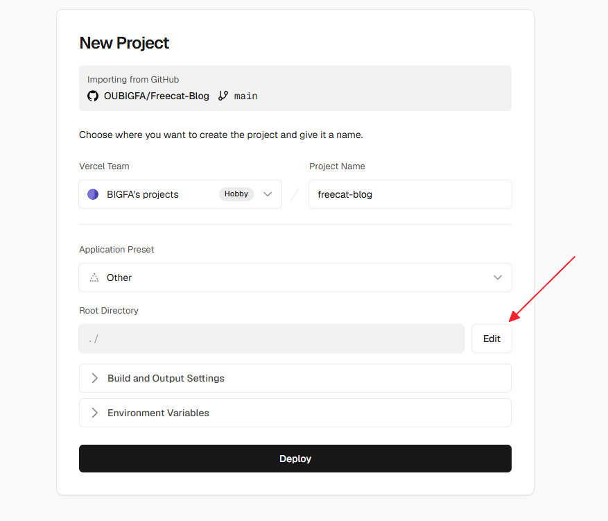
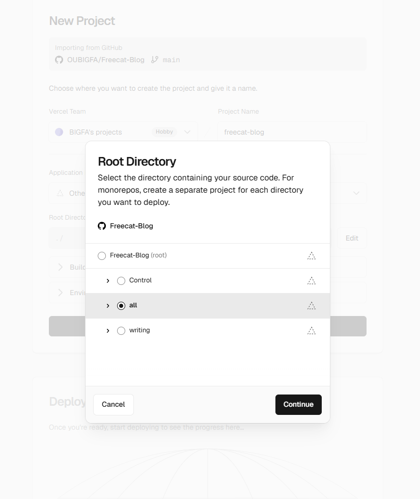

Freecat Blog 是一套面向新手的个人博客模板。本地写 Markdown，把改动同步到 GitHub，Cloudflare Pages 或 Vercel 会自动发布成网站。

GitHub地址：<https://github.com/OUBIGFA/Freecat-Blog>

演示网站：[演示站点 01](https://freecat-blog.pages.dev) | [演示站点 02](https://freecat-blog-op.pages.dev)

## 为什么选择 Freecat Blog

**数据在自己手上**
- 文章原稿保存在你的电脑和 GitHub 仓库里
- 即使云端部署或平台服务出错，也不会失去文字的所有权
- 不被单个平台锁住，随时可以备份、迁移或重新发布


**功能强大**
- 博文可自由置顶、隐藏
- 支持自定义一个或多个标签
- Markdown 支持渲染数学公式、图表、流程图、序列图、甘特图等
- 支持音频、视频播放
- 支持常规网站的外部嵌入展示
- 超长代码块自动折叠，内置回到顶部/底部和展开/折叠的跟随控制器
- 少即是多——去除所有多余动效与视觉干扰，无打扰的阅读体验，一切为了可阅读性


**对新手友好**
- 可选择完全不写元数据，直接写正文即可
- 通过 Markdown 元数据和控制文件里的简单填写或勾选，就能直观定制网站外观、资料、社交链接、置顶和显示状态，告别复杂后台和代码
- 支持 `.md`、`.txt` 等多种格式
- 不需要考虑排版，纯文字也可以


**排版自动优化**
- 自动优化中英混排间距
- 专注内容写作，系统自动处理格式


> **提示：** 如遇构建相关问题，只需前往主仓库复制最新的 [sync-upstream](https://github.com/OUBIGFA/Freecat-Blog/blob/main/.github/workflows/sync-upstream.yml) 或 [update-git-dates.yml](https://github.com/OUBIGFA/FreeBlog_BIGFA/blob/main/.github/workflows/update-git-dates.yml "update-git-dates.yml") 工作流文件到你的仓库并手动运行一次。该工作流仅同步构建文件，不会覆盖你的自定义设置和 writing/ 写作文件夹。如需使用新增功能，请从主仓库 [Control 文件夹](https://github.com/OUBIGFA/Freecat-Blog/tree/main/Control) 复制对应控制参数到你仓库的 `Control/` 文件夹。

不需要服务器，不需要编程基础。日常只要记住三个文件夹。

| 文件夹        | 功能    | 说明                         |
| ---------- | ----- | -------------------------- |
| `writing/` | 写文章   | 一篇 Markdown 文件就是一篇博客文章     |
| `Control/` | 改网站信息 | 改网站名、头像、首页介绍、社交链接、About 页面 |
| `all/`     | 构建资源  | 部署平台从这里构建网站                |

**写文章去** `writing/`，个性化去 `Control/`，部署构建根目录填 `all`。

Freecat Blog 也内置了搜索优化支持：可生成 Sitemap、RSS、llms.txt，并配有 Google、Bing 收录提交教程。需要设置正式域名、SEO 摘要、作者信息或 AI 爬虫策略时，直接看 `Control/SEO_搜索优化.md`。

[把网站交给 Google 和 Bing —— 小白零基础教程](https://freecat-blog.pages.dev/posts/2026060310280701)

***

## 最短部署路径预览

1. 用 [GitHub Importer](https://github.com/new/import) 导入并转换成私人博客仓库
2. 去 Cloudflare Pages 或 Vercel 导入仓库构建
3. 等部署完成，打开默认网址确认

***

## 最短使用路径预览

1. 用 [GitHub Desktop](https://desktop.github.com/download) 拉到本地
2. 本地打开项目，在`writing`文件夹中撰写或存入一篇文章（文章元数据非必需）
3. 通过GitHub Desktop提交并同步到 GitHub
4. 等待平台自动部署构建
5. 完成

***

## 就三件事

* 所有内容存在本地，换平台不丢数据。

* GitHub 管备份，同时通知部署平台更新。

* 部署平台只负责把仓库渲染成网站。

***

## 新手怎么挑部署平台

### 首选：Cloudflare Pages

适合绝大多数个人博客。

* 免费

* 稳定

* 配置清晰

* 静态网站托管成熟

* 绑自定义域名方便

### 备选：Vercel

已经有 Vercel 账号、或者习惯用 Vercel 的，也可以直接选它。

* 上手快

* 界面清爽

* 和 GitHub 联动顺

* 个人博客完全够用

完全新手选 Cloudflare Pages；已经在用 Vercel 的，选 Vercel。两个平台以后想换都容易，内容都在本地和 GitHub 上。

***

## 动手前准备这些

| 项目             | 是否必需 | 说明                                                 |
| -------------- | ---- | -------------------------------------------------- |
| GitHub 账户      | 必需   | 用于保存你的博客仓库                                         |
| GitHub Desktop | 必需   | 本地同步工具，[下载地址](https://desktop.github.com/download) |
| Markdown 编辑器   | 必需   | 写文章和改配置，推荐 [Obsidian](https://obsidian.md/zh)      |
| Cloudflare 账户  | 推荐   | 用于自动构建和发布网站                                        |
| Vercel 账户      | 可选   | 另一种自动部署方式                                          |

***

## 第一步：建一个自己的博客仓库

### 1. 登录 GitHub

1. 打开 <https://github.com/>
2. 登录账号
3. 没有账号就先注册一个

### 2. 打开 Importer 页面

浏览器访问 <https://github.com/new/import>

### 3. 填写导入表单

| 字段                                | 应填写的值                                     |
| --------------------------------- | ----------------------------------------- |
| `Your old repository's clone URL` | `https://github.com/OUBIGFA/Freecat-Blog` |
| `Owner`                           | 选你自己的 GitHub 账户                           |
| `Repository name`                 | 起一个名字，比如 `my-freecat-blog`                |
| `Privacy`                         | 选 `Private`                               |

### 4. 开始导入

1. 点页面底部的 `Begin import`
2. 等导入完成，一般几十秒到几分钟
3. 看到 `Your new repository ... is ready` 就成功了
4. 点进新仓库，确认能看到 `all/`、`Control/`、`writing/` 等文件夹

### 5. 下载到本地

1. 装好并登录 GitHub Desktop
2. 点 `File` → `Clone repository`
3. 选刚导入好的仓库
4. 选一个好找的本地位置
5. 点 `Clone`

到这一步，电脑里就有完整的 Freecat Blog 项目了。

***

## 第二步：部署参数速查表

两个平台的填法不一样，别照搬。

* **Cloudflare Pages**：按下表手动填写构建参数。
* **Vercel**：只需要把 Root Directory 选成 `all` 文件夹，其余全部保持默认（详见方案二）。

| 项目（Cloudflare Pages）                           | 应该填写什么            |
| --------------------------------------------- | ----------------- |
| 仓库                                            | 你自己的 GitHub 仓库    |
| 根目录 / Root Directory / Base Directory         | `all`             |
| 构建命令 / Build Command                          | `npm run build`   |
| 构建输出目录 / Output Directory / Publish Directory | `dist`            |
| 环境变量 / Environment Variable                   | `NODE_VERSION=20` |

最容易错的是输出目录。正确写 `dist`，不要写 `all/dist`，因为根目录已经切到 `all`，输出目录要按它里面的相对路径写。

把 `NODE_VERSION` 显式设为 `20`，免得受平台默认 Node 版本变动影响。

***

## 方案一：部署到 Cloudflare Pages

### 第 1 步：进入 Cloudflare Pages

1. 登录 [Cloudflare Dashboard](https://dash.cloudflare.com/)
2. 点「创建应用程序」


1. 选「Pages」


1. 选「导入现有 Git 储存库」


1. 选你自己的博客仓库


### 第 2 步：填写构建配置

项目名称随意起，关键参数按下表填。

| Cloudflare 界面中文 | Cloudflare UI English            | 应填写的值                 |
| --------------- | -------------------------------- | --------------------- |
| 框架预设            | Framework preset                 | `无 / None`，或不选预设      |
| 根目录（高级）         | Root directory (advanced) > Path | `all`                 |
| 构建命令            | Build command                    | `npm run build`       |
| 构建输出目录          | Build output directory           | `dist`                |
| 环境变量（选填）        | Environment variables            | `NODE_VERSION` = `20` |


填好点 `Save and Deploy`，等构建跑完。一般 1-3 分钟。

> 建议在 Cloudflare Pages 项目设置里启用 `Build cache（构建缓存）`。字体子集工具链完全走 npm 依赖，依赖缓存命中后安装只需几秒；仓库自带的字体子集能覆盖已知文章字符时会直接复用，文章新增字符后也只需几秒到几十秒就能在构建中增量扩充字体集，无需 Python 环境。

### 第 3 步：访问默认网址

构建完成后，Cloudflare 会给你一个 `xxx.pages.dev` 形式的默认网址。打开能看到博客页面，就说明部署成功。


### 第 4 步：以后怎么更新网站

之后不用手动上传文件，按这个流程走。

1. 本地写文章或改配置
2. 用 GitHub Desktop 提交并同步到 GitHub
3. Cloudflare 自动重新构建
4. 网站自动更新

### 第 5 步：绑定自己的域名

想用自己的网址，在 Cloudflare Pages 项目里绑定自定义域名，按平台提示改 DNS 解析就行。

可以参考：

* [免费域名申请指南](https://blog.freeorg.dpdns.org/posts/2026053112195526)

* [DNSHE 自动续期项目](https://github.com/OUBIGFA/dnshe-auto-renew)

### Cloudflare Pages 常见坑

#### 坑 1：根目录没填 `all`

项目实际在 `all/` 里。不填的话，平台会从仓库根目录找 `package.json`，多半构建失败。

#### 坑 2：输出目录填成 `all/dist`

根目录已经是 `all`，输出目录直接写 `dist` 就行，不用再带前缀。

#### 坑 3：随便选了框架预设

这个项目不属于 Next.js、Nuxt、Astro 这类框架，预设选 `None / 无` 最稳。

#### 坑 4：网站没更新就以为失败

先看 Cloudflare 后台最新那次构建有没有成功，再 `Ctrl + F5` 强刷一下。很多时候只是浏览器缓存。

***

## 方案二：部署到 Vercel

习惯用 Vercel 的，按这个流程来。

### 第 1 步：导入 GitHub 仓库

1. 登录 [Vercel](https://vercel.com/)
2. 点 `Add New...`
3. 选 `Project`
4. 连接 GitHub
5. 授权 Vercel 访问你的仓库
6. 选你自己的博客仓库

### 第 2 步：把 Root Directory 选成 all 文件夹

Vercel 只需要改这一处，其余设置全部保持默认，不要手动填构建命令或输出目录。

1. 在导入页面找到 `Root Directory`，点右侧的 `Edit`



2. 在弹窗里勾选 `all` 文件夹，点 `Continue`



构建命令、输出目录和页面地址规则，由仓库自带的 `all/vercel.json` 自动接管，所以都不用填。

> 最容易踩的坑：Root Directory 没选 `all`，或者展开 `Build and Output Settings` 手动覆盖了构建设置。这两种情况都会让 Vercel 读不到 `all/vercel.json`，部署出来的网站页面会全部 404。

Vercel 会自动恢复构建缓存。Freecat Blog 会复用其中的字体子集缓存；文章没有新增字符时，后续部署会跳过字体生成；即使删除文章，已经生成过的字符也会继续保留。除非你确实想强制重新生成，否则不要在项目设置里主动清空 Build Cache。

### 第 3 步：部署并访问

1. 点 `Deploy`
2. 等 Vercel 构建完成，一般 1-3 分钟
3. 成功后打开 Vercel 给的默认网址

### 第 4 步：绑定自己的域名

进项目设置里的 `Domains`，加上自己的域名，按 Vercel 提示改解析。

***

## 第三步：开始写文章

`writing/` 是日常用得最多的文件夹，一个 `.md` 文件就是一篇文章。可以打开示例文章看格式、复制一篇当模板、新建自己的 `.md`，不要的示例直接删掉。

一篇文章通常长这样。

```md
---
title: 我的第一篇文章
date: 2026-05-03
tag:
  - 随笔
cover:
show_image_captions: true
description: 这里写文章摘要
pinned: false
show: true
copy_content: false
---

这里开始写正文。
```

常用字段：

| 字段                    | 作用               |
| --------------------- | ---------------- |
| `title`               | 文章标题，留空时用文件名     |
| `date`                | 发布或显示日期          |
| `tag`                 | 标签，可以写多个         |
| `cover`               | 封面图片 URL，留空则没有封面 |
| `show_image_captions` | 是否显示图片下方说明文字     |
| `description`         | 文章摘要，留空则自动截取     |
| `pinned`              | 是否置顶             |
| `show`                | 是否在网站上展示         |
| `copy_content`        | 是否允许复制正文         |

***

## 第四步：个性化网站

`Control/` 是网站控制台。想把模板改成自己的博客，主要就改这里。

| 文件               | 负责什么                             |
| ---------------- | -------------------------------- |
| `site_网站属性.md`   | 网站标题、站点名、首页介绍、头像、主题              |
| `SEO_搜索优化.md`    | 正式域名、SEO 摘要、作者信息、AI 爬虫和 llms.txt |
| `social_社交媒体.md` | 社交媒体图标、主页链接、联系方式、推广链接            |
| `about_关于页面.md`  | About 页面的标题、介绍和头像                |

编辑要点：

* 所有参数都写在文件顶部 `---` 包起来的 Frontmatter 区块里

* 格式是 `键: 值`，冒号后留一个空格

* 留空字段保留 `键:` 即可，别删整行

* `_01`、`_02` 这类是说明文字，构建时会忽略，别改名

### `site_网站属性.md`

常改的几项：网站名称、网站描述、首页标题、头像、网站图标、默认主题、每页显示文章数量、底部版权文字。

主题设置里，下面三个字段只能有一个为 `true`。

* `theme_system`

* `theme_light`

* `theme_dark`

三个都为 `false` 时，会自动回退到跟随系统。别三个一起写 `true`。

### `social_社交媒体.md`

每个社交平台一般有三类字段。

| 字段类型  | 例子                               | 作用                   |
| ----- | -------------------------------- | -------------------- |
| 启用开关  | `github_enabled: true`           | `true` 显示，`false` 隐藏 |
| 自定义图标 | `github_icon_url:`               | 留空走默认图标，也可填自己的图标 URL |
| 主页链接  | `github_url: https://github.com` | 点图标后跳转到哪             |

用不到的平台，把对应的 `*_enabled` 改成 `false`。

### `about_关于页面.md`

常用字段。

| 字段                    | 说明                   |
| --------------------- | -------------------- |
| `about_hero_title`    | About 页面的标题，留空则用首页标题 |
| `about_hero_subtitle` | About 页面的介绍，留空则用首页介绍 |
| `about_hero_avatar`   | About 页面的头像，留空则用首页头像 |

想让 About 和首页保持一致，这三个字段都留空即可。

***

## 日常更新流程

以后每次更新博客，照这个流程走。

1. 在本地写文章或改配置
2. 保存文件
3. 打开 GitHub Desktop
4. 写一句提交说明
5. 点 `Commit to main`
6. 点 `Push origin`
7. 等部署平台自动更新
8. 打开网站检查结果

这一套跑通，博客就能长期稳定用下去。

***

## 文章内音频、视频播放器

文章里可以直接放音频播放器和视频播放器。关键是：链接必须是“文件直链”，不是普通网盘分享页。

普通分享链接通常长这样：打开后先进入一个网盘页面，再点下载或播放。网站无法直接把这种页面变成播放器。

文件直链通常长这样：复制到浏览器地址栏后，会直接打开或下载这个音频、视频文件。网站需要的就是这种链接。

### 音频播放器

在文章里用图片格式 + 音频直链，会自动出现音频播放器。

```

```


链接没有明显音频后缀的话，在标题里加个 `🎵` 强制识别。

```

```


支持的常见音频格式：`.mp3`、`.m4a`、`.wav`、`.ogg`、`.aac`、`.flac`、`.opus`。

### 视频播放器

在文章里用图片格式 + 视频直链，会自动出现视频播放器。

```

```


链接没有明显视频后缀的话，在标题里加个 `🎬` 强制识别。

```

```

支持的常见视频格式：`.mp4`、`.webm`、`.mov`、`.m4v`、`.ogv`、`.m3u8`。

### 从网盘分享链接转换成直链

推荐先把音频、视频上传到网盘，再用直链工具把“分享链接”转换成文章里能直接使用的“文件直链”。

推荐工具：

* [网盘直链获取工具](https://link.gimhoy.com/)

* [网盘分享链接转直链工具](https://lz.qaiu.top/)

* [小飞机云盘](https://www.feijipan.com)

最简单的操作流程：

1. 把音频或视频上传到网盘。
2. 在网盘里创建分享链接，并复制这个分享链接。
3. 打开上面的直链工具，把分享链接粘贴进去。
4. 点击解析、转换或获取直链。
5. 复制工具生成的新链接。
6. 把新链接放进文章里的音频或视频示例格式中。

例如，工具生成的是音频直链，就这样写：

```

```


工具生成的是视频直链，就这样写：

```

```


判断链接能不能用，有一个很直白的方法：把链接复制到浏览器地址栏里打开。如果浏览器直接播放、直接下载，或者页面只显示这个文件本身，一般就可以用。如果打开后还是网盘页面、登录页面、提取码页面、广告页，通常就不能直接当播放器链接用，需要重新转换。

注意：网盘直链可能会失效。如果以后文章里的播放器突然不能播放，先重新打开原分享链接检查文件是否还在，再用直链工具重新生成一次链接。

***

## 模板更新怎么同步过来

Freecat Blog 会持续更新模板工程，比如修 bug、加功能、优化样式。仓库里自带一个 GitHub Actions 工作流：`.github/workflows/sync-upstream.yml`。

每周二北京时间凌晨 02:17，它会自动从主仓库 [OUBIGFA/Freecat-Blog](https://github.com/OUBIGFA/Freecat-Blog) 同步模板文件，提交到你的仓库。部署平台收到新提交后会自动重建网站。

同步范围：

* 会同步：`all/`、`README.md`、`README.en.md`

* 会保留：`all/git-dates.json`、`all/build/font-subsets-manifest.json`、`all/src/assets/fonts/`

* 不会动：`Control/`、`writing/`、`.github/`、`.gitignore`

也就是说，你写的文章和网站配置不会被模板更新覆盖。

想马上手动触发一次同步：

1. 打开你的 GitHub 仓库
2. 点顶部 `Actions`
3. 左侧选 `Sync upstream template files`
4. 右上角点 `Run workflow`
5. 再点一次 `Run workflow` 确认

几个细节：

* 上游模板没变化时，工作流会跳过提交。

* GitHub Actions 定时触发可能延迟几分钟，属正常现象。

* 改过 `all/` 里的模板、样式或构建脚本的话，自动同步可能覆盖这些改动。新手通常别动 `all/`。

***

## 进阶：用 Obsidian 做本地写作中心

可以把这个博客仓库直接当成 Obsidian 仓库用。

推荐流程：

1. 用 Obsidian 打开本地博客文件夹
2. 在 `writing/` 目录写文章
3. 改完顺手检查文章头部属性
4. 用 GitHub Desktop 同步
5. 等平台自动部署

写完就同步，大改前也先同步一次，别让没保存的内容只留在某个临时软件里。这样内容更安全。

***

## 进阶：本地预览和构建

只是写文章和部署的话，不用本地构建，平台会自动处理。

想在本机提前预览网站，先装 [Node.js 20+](https://nodejs.org/)，再在项目里运行：

```bash
cd all
npm install
npm run build
```

构建产物在 `all/dist/`。这是自动生成的目录，不用手动改，也不用提交到 GitHub。

***

## 进阶：先用好皮肤，再考虑改皮肤

这套博客可以理解成「一套博客皮肤 + 一套本地写作和自动发布工作流」。

对新手来说，先把部署跑通。能稳定写文章、形成更新节奏之后，再考虑改外观和功能。上线才有反馈，写了内容才知道缺什么，稳定用一段时间再改，比一上来折腾皮肤要稳。

***

## 进阶：怎么搭配 AI 一起用

Markdown 是纯文本，整理、改写、拆分都方便，适合配合 AI 工具用。

可以让 AI 帮你做这些事：

* 润色文章

* 生成标题

* 改写摘要

* 拆分长文结构

* 优化排版

* 想选题

* 做专题策划

建议先自己写出内容，再让 AI 整理、补强、压缩或扩展。这样文章更像你写的，不会一股模板味。

智能体软件参考：

> [用户体验拉满的智能体软件汇总](https://blog.freeorg.dpdns.org/posts/2026053112195550)

***

## 常见问题

### 我必须会编程吗

不用。只想写文章 + 部署，按这篇教程一步步来就够。

### 我必须先买域名吗

不用。Cloudflare Pages 和 Vercel 都会先给一个默认网址，以后想换自己的域名再说。

### `.gitignore` 是什么，什么时候要用

`.gitignore` 是仓库根目录里的一个文件，可以把它理解成“不要同步到 GitHub 的文件清单”。

你本地可能会出现一些不适合上传的文件，比如：

* 临时草稿
* 测试日志
* 系统自动生成的文件
* 自己电脑上的私人配置

这些文件不属于网站内容，提交到 GitHub 反而容易让仓库变乱。把它们写进 `.gitignore` 后，GitHub Desktop 通常就不会再提示你提交它们。

比如你想忽略本地草稿文件夹、系统文件和日志文件，可以这样写：

```gitignore
# 忽略本地草稿文件夹
drafts/

# 忽略系统自动生成的文件
.DS_Store
Thumbs.db

# 忽略临时日志
*.log
```

写法很简单：

* 忽略某个文件夹：写 `文件夹名/`，例如 `drafts/`
* 忽略某个具体文件：写完整文件名，例如 `Thumbs.db`
* 忽略某一类文件：用 `*` 表示任意名字，例如 `*.log`

新手最常见的做法是：在仓库根目录打开 `.gitignore`，把不想上传的新文件或新文件夹按上面的格式加进去，保存后再看 GitHub Desktop 的变化列表。

注意：`.gitignore` 只会忽略“还没有提交过”的新文件。如果某个文件已经提交到 GitHub，后来再写进 `.gitignore`，它不会自动从仓库里消失。

### 为什么我本地改完了，网站没变

按顺序检查：

1. 文件有没有保存
2. GitHub Desktop 有没有提交
3. 有没有同步到 GitHub
4. 部署平台有没有开始自动构建
5. 浏览器是不是缓存了旧页面

### 以后能从 Vercel 换到 Cloudflare Pages 吗

可以。文章和配置都在本地和 GitHub 上，换平台重新导入仓库就行。

### 我最容易填错什么

最常出错的就这两项：

* Root Directory / Base Directory 没填 `all`

* Output Directory / Publish Directory 错填成 `all/dist`

正确填法：

* 根目录：`all`

* 输出目录：`dist`

### 可以删除示例文章吗

可以。示例都在 `writing/` 里，删掉后提交并同步即可。

### 可以直接改 `all/` 吗

新手不建议。`all/` 是模板工程目录，自动同步上游模板时这里的改动可能被覆盖。日常写作和个性化主要在 `writing/` 和 `Control/` 里改。
