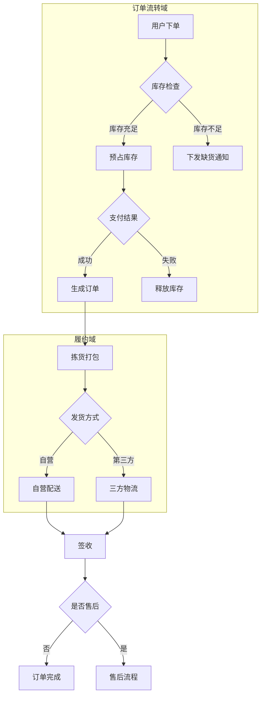

# Markdown 格式完整测试

## 📋 所有格式枚举测试

这是一个包含所有 Markdown 格式的完整测试文档，用于检查社交平台兼容性。

---

## 1️⃣ 标题层级测试

# 一级标题 H1
## 二级标题 H2
### 三级标题 H3
#### 四级标题 H4
##### 五级标题 H5
###### 六级标题 H6

---

## 2️⃣ 文本格式测试

### 基础文本格式
- **粗体文本** 和 __另一种粗体语法__
- *斜体文本* 和 _另一种斜体语法_
- ***粗斜体文本*** 和 ___另一种粗斜体___
- ~~删除线文本~~
- `行内代码` 示例
- 普通文本和 **混合** *格式* ~~测试~~

### 特殊字符和转义
- 反引号: \`code\`
- 星号: \*text\*
- 下划线: \_text\_
- 波浪号: \~\~text\~\~

---

## 3️⃣ 列表测试

### 无序列表
- 第一项
- 第二项
  - 嵌套项 1
  - 嵌套项 2
    - 深层嵌套项
    - 另一个深层项
  - 嵌套项 3
- 第三项
- 包含 **粗体** 和 *斜体* 的项
- 包含 `代码` 的项

### 有序列表
1. 第一项
2. 第二项
   3. 嵌套有序项 1
   4. 嵌套有序项 2
      1. 深层嵌套
      2. 另一个深层嵌套
   5. 嵌套有序项 3
6. 第三项
7. 包含 **格式** 的项
8. 包含 `代码` 的项

### 任务列表
- [x] 已完成任务
- [x] 另一个已完成任务
- [ ] 未完成任务
- [ ] 包含 **粗体** 的任务
- [x] 包含 `代码` 的已完成任务
- [ ] 包含 [链接](https://github.com) 的任务

---

## 4️⃣ 引用块测试

### 简单引用
> 这是一个简单的引用块。

### 多行引用
> 这是多行引用的第一行。
>
> 这是第二行，中间有空行。
>
> 这是第三行。

### 嵌套引用
> 这是外层引用。
>
> > 这是嵌套引用。
> >
> > > 这是更深层的嵌套引用。
>
> 回到外层引用。

### 引用中的格式
> 引用中可以包含 **粗体**、*斜体* 和 `代码`。
>
> 也可以包含 [链接](https://github.com)。

---

## 5️⃣ 代码测试

### 行内代码
这是 `行内代码` 示例，包含 `console.log('Hello')` 这样的代码片段。

### 代码块（无语言标识）
```
这是没有语言标识的代码块
可以包含任意文本
保持原有格式和缩进
```

### JavaScript 代码块
```javascript
// JavaScript 代码示例
function greet(name) {
  console.log(`Hello, ${name}!`);
  return `Welcome, ${name}`;
}

const user = 'World';
greet(user);
```


### Mermaid 复杂图示例


---

## 6️⃣ 数学公式测试

### 行内公式
爱因斯坦质能方程 $E = mc^2$ 是物理学中最著名的公式之一。

圆的面积公式为 $A = \pi r^2$，其中 $r$ 是半径。

### 块级公式

$$
x = \frac{-b \pm \sqrt{b^2 - 4ac}}{2a}
$$

### 更多公式示例

矩阵表示：
$$
\begin{pmatrix}
a & b \\
c & d
\end{pmatrix}
$$

求和与积分：
$$
\sum_{i=1}^{n} i = \frac{n(n+1)}{2}
$$

$$
\int_{0}^{\infty} e^{-x^2} dx = \frac{\sqrt{\pi}}{2}
$$

---

## 7️⃣ 表格测试

### 简单表格
| 列1 | 列2 | 列3 |
|-----|-----|-----|
| 数据1 | 数据2 | 数据3 |
| 数据4 | 数据5 | 数据6 |

### 对齐表格
| 左对齐 | 居中对齐 | 右对齐 |
|:-------|:-------:|-------:|
| 左 | 中 | 右 |
| 数据较长的内容 | 居中内容 | 右侧内容 |

### 包含格式的表格
| 功能 | 语法 | 示例 |
|------|------|------|
| **粗体** | `**text**` | **示例文本** |
| *斜体* | `*text*` | *示例文本* |
| [链接](https://github.com) | `[text](url)` | [GitHub](https://github.com) |

---

## 8️⃣ 分割线测试

使用三个或更多连字符：

---

使用三个或更多星号：

***

使用三个或更多下划线：

___

---

## 📝 测试总结

以上包含了所有常用的 Markdown 格式：

✅ **已测试格式**：
- 标题（H1-H6）
- 文本格式（粗体、斜体、删除线、行内代码）
- 列表（有序、无序、任务列表、嵌套）
- 引用块（简单、多行、嵌套）
- 代码块（多种语言）
- 数学公式（行内公式、块级公式）
- 表格（简单、对齐、包含格式）
- 分割线

🎯 **测试目标**：检查所有格式在社交平台中的显示效果和兼容性。

---

引用自：https://mmdeditor.boxtech.icu

---

# bm.md

bm.md 是一个专业的 Markdown 排版工具，专为内容创作者设计。本文档详细介绍所有功能特性。

---

> [!NOTE]
> 复制到知乎、掘金功能还在开发中，敬请期待。

## 多文件管理

### 文件标签页

支持同时打开多个 Markdown 文件：

- **多标签切换** - 顶部标签栏显示所有打开的文件
- **双击重命名** - 双击标签可重命名文件
- **自动命名** - 根据文档首个 H1 标题自动命名
- **IndexedDB 存储** - 文件内容持久化存储，刷新不丢失
- **新建文件** - 点击 + 按钮创建新文件
- **关闭文件** - 点击标签上的 ✕ 关闭文件

### 文件存储

- 文件元数据存储在 LocalStorage
- 文件内容存储在 IndexedDB
- 浏览器不支持时自动降级为内存存储

---

## 编辑器功能

### Markdown 编辑器

基于 CodeMirror 6 构建的高性能编辑器：

- **语法高亮** - Markdown 语法实时着色
- **代码折叠** - 支持折叠代码块和长段落
- **Ayu 主题** - 与整体 UI 风格统一的编辑器配色

### 文件导入

支持多种方式导入内容：

- **本地文件选择** - 支持 `.md`、`.markdown` 格式
- **拖拽导入** - 直接拖拽文件到编辑器区域
- **粘贴导入** - 支持粘贴 HTML 内容自动转换为 Markdown
- **快捷键** - `Cmd/Ctrl + O` 快速打开文件

### Markdown 格式化

一键美化 Markdown 代码：

- 基于 markdownlint 规则自动修复
- 统一标题、列表、空行等格式
- 快捷键 `Cmd/Ctrl + Shift + L`

### 导出 Markdown

将编辑器内容保存为本地文件：

- 导出为 `.md` 文件
- 快捷键 `Cmd/Ctrl + S`

---

## 预览功能

### 实时预览

编辑即可见的预览体验：

- **增量更新** - 使用 morphdom 进行 DOM diff，仅更新变化部分
- **防抖渲染** - 100ms 防抖，避免频繁渲染
- **样式隔离** - iframe 沙箱隔离，预览样式不影响编辑器

### 视图切换

适配不同设备的预览宽度：

- **移动端视图** - 415px 宽度，iPhone 设备框展示
- **桌面端视图** - 768px 宽度，Safari 浏览器框展示
- 自动响应容器宽度变化

### 滚动同步

编辑器与预览区域双向滚动同步：

- 编辑器滚动时预览跟随
- 预览滚动时编辑器跟随
- 可通过设置开关此功能

---

## 主题系统

### Markdown 排版样式

内置 13 种精心设计的排版风格：

| 样式 ID             | 名称              | 风格描述                   |
| ------------------- | ----------------- | -------------------------- |
| `ayu-light`         | Ayu Light         | 清新淡雅的浅色主题         |
| `bauhaus`           | Bauhaus           | 包豪斯风格，几何与功能主义 |
| `botanical`         | Botanical         | 植物园风格，自然柔和       |
| `green-simple`      | GreenSimple       | 简约绿色风格               |
| `sketch`            | Sketch            | 手绘素描风格               |
| `newsprint`         | Newsprint         | 报纸印刷风格               |
| `terminal`          | Terminal          | 终端/命令行风格            |
| `neo-brutalism`     | Neo-Brutalism     | 新野兽派，大胆对比         |
| `playful-geometric` | Playful Geometric | 活泼几何图形风格           |
| `professional`      | Professional      | 专业商务风格               |
| `organic`           | Organic           | 有机自然风格               |
| `maximalism`        | Maximalism        | 极繁主义，丰富装饰         |
| `retro`             | Retro             | 复古怀旧风格               |

### 代码高亮主题

支持 10 种代码块高亮主题（来自 highlight.js）：

| 主题 ID              | 名称               | 类型 |
| -------------------- | ------------------ | ---- |
| `tokyo-night-light`  | Tokyo Night Light  | 浅色 |
| `tokyo-night-dark`   | Tokyo Night Dark   | 深色 |
| `panda-syntax-light` | Panda Syntax Light | 浅色 |
| `panda-syntax-dark`  | Panda Syntax Dark  | 深色 |
| `rose-pine-dawn`     | Rosé Pine Dawn     | 浅色 |
| `rose-pine`          | Rosé Pine          | 深色 |
| `kimbie-light`       | Kimbie Light       | 浅色 |
| `kimbie-dark`        | Kimbie Dark        | 深色 |
| `paraiso-light`      | Paraiso Light      | 浅色 |
| `paraiso-dark`       | Paraiso Dark       | 深色 |

### 浅色/深色模式

应用整体支持浅色和深色两种模式：

- 基于 next-themes 实现
- View Transition API 实现平滑切换动画

### 自定义 CSS

在主题样式基础上进行二次定制：

- 点击预览区工具栏的画笔图标打开配置
- CSS 选择器需约束在 `#bm-md` 下
- 自定义样式在主题样式之后应用，可覆盖默认样式
- 支持通过 API/MCP 传入 `customCss` 参数
- 配置自动保存到本地存储

示例：

```css
/* 修改标题颜色 */
#bm-md h1 {
  color: #e74c3c;
}

/* 调整段落行高 */
#bm-md p {
  line-height: 1.8;
}

/* 自定义引用块样式 */
#bm-md blockquote {
  border-left-color: #9b59b6;
  background: #f8f4fc;
}
```

---

## 多平台导出

### 一键复制

针对不同平台优化的复制功能：

| 平台         | 快捷键                 | 特殊处理                               |
| ------------ | ---------------------- | -------------------------------------- |
| 微信公众号   | `Cmd/Ctrl + Shift + 7` | 链接转脚注、代码空格保护、表格滚动适配 |
| ~~知乎专栏~~ | `Cmd/Ctrl + Shift + 8` | ~~适配知乎编辑器~~                     |
| ~~掘金~~     | `Cmd/Ctrl + Shift + 9` | ~~适配掘金编辑器~~                     |
| HTML         | `Cmd/Ctrl + Shift + 0` | 通用 HTML 输出                         |

所有输出均使用 CSS 内联（通过 juice），可直接粘贴到富文本编辑器。

### 图片导出

将预览内容导出为图片：

- 使用 SnapDom 进行截图
- 输出 JPEG 格式

---

## 图片上传

### 临时图片存储

支持上传图片到临时存储：

- S3 兼容存储（可配置）
- 支持拖拽图片到编辑器
- 支持粘贴剪贴板图片
- 文件大小限制 5MB
- 支持常见图片格式

---

## 开发者集成

### REST API

提供 4 个核心 API 端点：

| 端点                         | 功能                 |
| ---------------------------- | -------------------- |
| `POST /api/markdown/render`  | Markdown 渲染为 HTML |
| `POST /api/markdown/parse`   | HTML 转换为 Markdown |
| `POST /api/markdown/extract` | 提取纯文本           |
| `POST /api/markdown/lint`    | 格式校验与修复       |

完整 API 文档可访问 `/docs` 查看（Scalar UI）。

### MCP 协议

支持 Model Context Protocol，可集成到 AI Agent：

- 提供 4 个工具：`render`、`parse`、`extract`、`lint`
- Streamable HTTP 传输
- 配置说明可访问 `/docs/mcp` 查看

---

## PWA 支持

### 离线访问

应用支持 PWA（渐进式 Web 应用）：

- 离线可用 - 核心功能无需网络
- 可安装 - 支持添加到主屏幕
- 文件关联 - 支持在操作系统中直接用 bm.md 打开 `.md` 文件

---

## 快捷操作

### 命令面板

类似 Raycast/Spotlight 的全局命令面板：

- `Cmd/Ctrl + K` 打开
- 搜索所有可用命令
- 支持子菜单（主题选择等）

### 编辑器设置

可配置的编辑器行为：

| 设置      | 说明                      |
| ------- | ----------------------- |
| 引用链接列表  | 将文中链接转换为脚注形式            |
| 新窗口打开链接 | 为链接添加 `target="_blank"` |
| 滚动同步    | 编辑器与预览双向滚动同步            |

---

## Markdown 语法支持

### 基础语法

#### 标题

# 一级标题

## 二级标题

### 三级标题

#### 四级标题

##### 五级标题

###### 六级标题

#### 文本格式

这是**粗体文本**，这是*斜体文本*，这是~~删除线文本~~，这是***粗斜体文本***。

#### 列表

无序列表：

- 项目一
- 项目二
  - 嵌套项目
  - 另一个嵌套

有序列表：

1. 第一项
2. 第二项
   1. 嵌套项目
   2. 另一个嵌套

#### 引用块

> 这是一段引用文字，可以用来强调重要内容或引用他人观点。
>
> 引用可以包含多个段落。
>
> > 这是嵌套引用，用于多层次的引用场景。

#### 代码

行内代码：使用 `const x = 1` 定义常量。

代码块示例：

```javascript
function greet(name) {
  console.info(`Hello, ${name}!`)
}

greet('World')
```

#### 链接与图片

这是一个[普通链接](https://bm.md)，这是一个[带标题的链接](https://bm.md 'bm.md 官网')。


---

### GFM 扩展

#### 表格

| 功能       |  状态   |                   备注 |
| :--------- | :-----: | ---------------------: |
| 实时预览   | ✅ 完成 |               核心功能 |
| 多平台导出 | ✅ 完成 | 微信/~~知乎~~/~~掘金~~ |
| 图片上传   | ✅ 完成 |                S3 存储 |

#### 任务列表

- [x] 支持基础 Markdown 语法
- [x] 支持 GFM 扩展语法
- [x] 支持数学公式渲染
- [ ] 支持 Mermaid 图表（计划中）

#### 自动链接

直接输入 URL 自动识别：https://bm.md

邮箱地址也支持：bm.md@bm.md

---

### 高级功能

#### 脚注

Markdown[^1] 是一种轻量级标记语言，由 John Gruber[^gruber] 于 2004 年创建。

[^1]: Markdown 文件通常使用 `.md` 或 `.markdown` 扩展名。

[^gruber]: John Gruber 是 Daring Fireball 博客的创始人。

#### 数学公式

支持 KaTeX 渲染。行内公式：$E = mc^2$，质能方程揭示了质量与能量的关系。

块级公式：

$$
\sum_{i=1}^{n} x_i = x_1 + x_2 + \cdots + x_n
$$

#### GitHub Alert

> [!NOTE]
> 这是一条提示信息，用于补充说明。

> [!TIP]
> 这是一条小技巧，帮助用户更好地使用功能。

> [!IMPORTANT]
> 这是重要信息，请务必注意。

> [!WARNING]
> 这是警告信息，操作前请三思。

> [!CAUTION]
> 这是危险警告，可能导致数据丢失或不可逆操作。

---
引用自：https://bm.md
